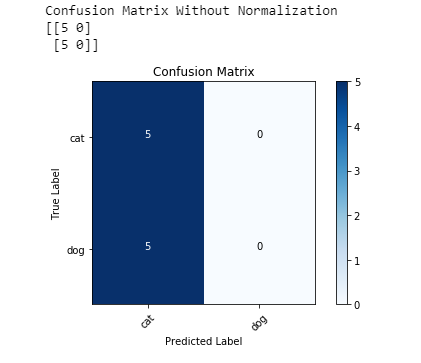
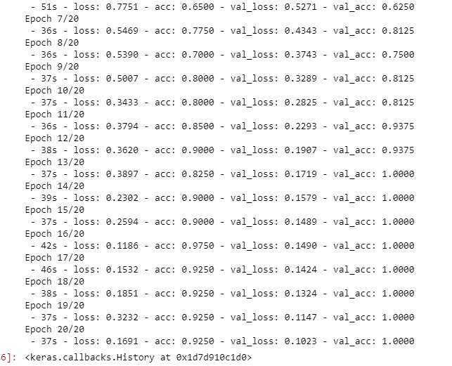
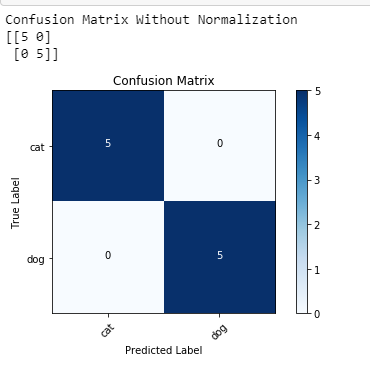
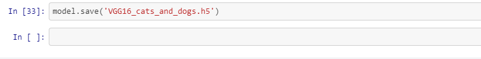
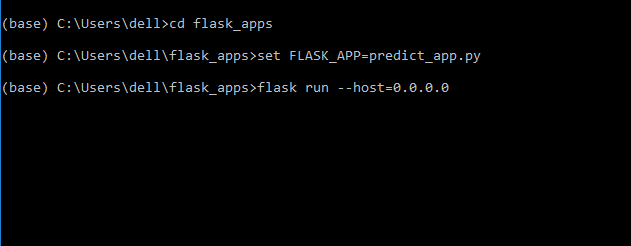
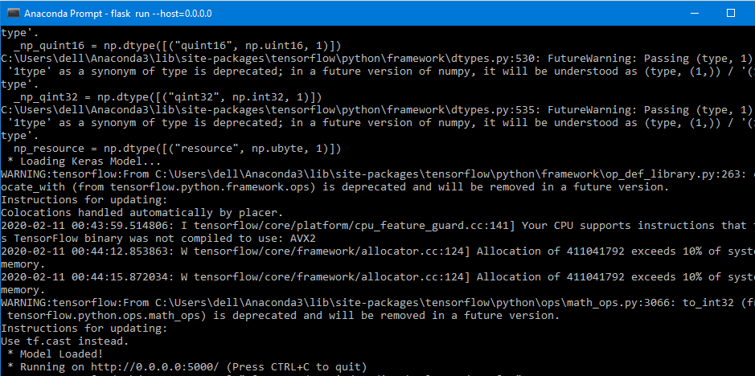
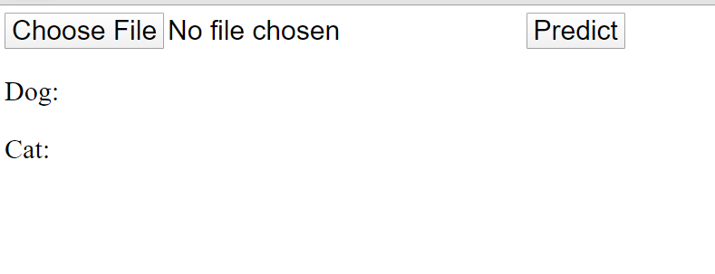
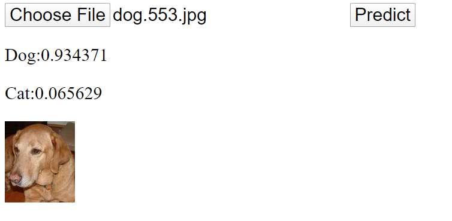

# Image Classification Using Convolutional Neural Network with Deployment in flask

First we trained our model, which gives 50% accuracy. The parameters for measuring accuracy is confusion matrix.

We then uses VGG16 pretrained model Pretrained model gives accuracy of around 100 % 

The confusion matrix for VGG16 pretrained model is below :-

We then save our model i.e h5 file as VGG16_cats_and_dogs.h5. We will use this h5 file to do predictions in real time.

Then we install flask to run our model at real time and to do real time predictions.

Then our model is loaded.

Then our flask predict_html page is looks likes

Then when we clicked the predict button, it will gives the prediction for cats and dogs of given image at real time.

